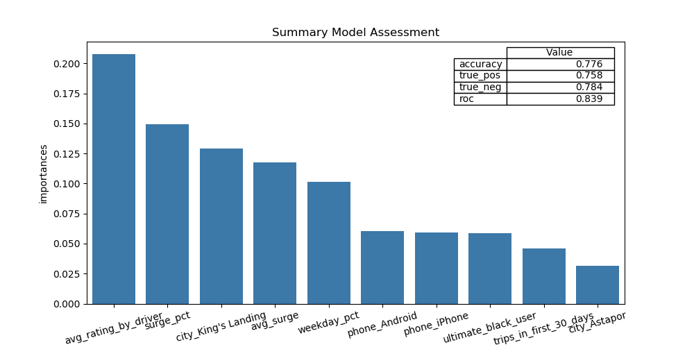

# Overview of Ultimate Data Challenge Submission

## 3 Questions:Detailed
Description in *ultimate_data_challenge.pdf*

** 1. Visualize Login Data:**  *Full Answer: Question 1 Notebook*

** 2. Design Experiment for toll policy change:** *Full Answer: Question 2 Essay (pdf) *

** 3. Build Model to predict Customer retention**  *Full Answer: Question 3 Notebook*

*Question 1 Summary:*

1. There is missing data, and the month of April is only present through the 13th of the month.
2. There is a time dependence in customer logins, with plots of the actual data in the notebook as well as a summary of the average hourly logons
3. There is a clear relation between day of week and number of logins, this is summarized in a box and whisker plot
4. All of the data above is combined into a heatmap, which is reordered to show that the busiest times for this car service are in the latenight and early morning hours (likely at closing time for bars and restauants) with another surge at lunch time on weekdays

*Question 2 Summary:*
    
Question 2 is a straightforward design of experiments problem to test a policy change for the toll between two cities. The essay discusses careful planning to avoid sampling bias, using a control and test group in each city, and measuring the results with standard hypothesis techniques.  It concludes with a reminder to check teh economic impact of the policy, though that is outside the scope of the problem description.

*Question 3 Summary:*

Question 3 is a customer retention problem that requires developingof the variables, decision processes for missing values, and one hot encoding for categorical variables.  A RandomForrest classifer is optimized with a Randomized search on selected hyper parameters and fit to the data.  

The results were acceptable for a quick model.  76% of the projected retained customers actuall stay, 78% of the projected defections happen, and an roc score of 0.83 is achieved.  The code is easily extensible to allow testing other classifiers or increasing the accuracy of this model with something like a more computationally intensive grid search.

Despite the simplicity of the model, several useful things emerge for the client to review and try to improve.  Examples include a difference in the retention rates of Android and iPhone app users, a difference in retention rates between cities, and a clear customer focus on surge pricing.
